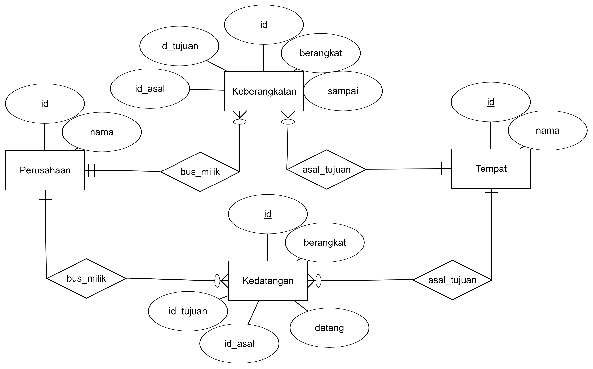

# Bus Schedule REST
RESTful website for [Bus Schedule React](https://github.com/fannyhasbi/bus-schedule-react)

## Entity Relationship Diagram
Here I create my own ERD for the application



## Installation
1. Move to your webserver folder. ex: `/opt/lampp/htdocs` or `C:\xampp\htdocs`
2. Clone or Download this repository
   ```bash
   git clone https://github.com/fannyhasbi/bus-schedule-rest
   ```
3. Install packages using [Composer](https://getcomposer.org/).
   ```bash
   composer install
   ```
4. Open your browser and access `http://localhost/bus-schedule-rest`

## Request
### Bus
**GET** `/api/bus`

Endpoint to get bus data

Success response example
```json
{
  "status": 200,
  "message": "OK",
  "data": [
    {
      "id": 1,
      "nama": "Sinar Jaya"
    },
    {
      "id": 2,
      "nama": "Nusantara"
    }
  ]
}
```

### Add Bus
**POST** `/api/add-bus`

Endpoint to add new bus data

Post parameters

| Property | Type | Description |
| --- | --- | --- |
| perusahaan | String | Name of bus company |

Success response example
```json
{
  "status": 200,
  "message": "OK",
  "data": null
}
```

### Place
**GET** `/api/place`

Endpoint to get place data

Success response example
```json
{
  "status": 200,
  "message": "OK",
  "data": [
    {
      "id": 1,
      "nama": "Semarang"
    },
    {
      "id": 2,
      "nama": "Tegal"
    }
  ]
}
```

### Departure
**GET** `/api/departure`

Endpoint to get departure data

Success response example
```json
{
  "status": 200,
  "message": "OK",
  "data": [
    {
      "id": 1,
      "id_perusahaan": 1,
      "nama_perusahaan": "Sinar Jaya",
      "id_tujuan": 2,
      "nama_tujuan": "Tegal",
      "id_asal": 1,
      "nama_asal": "Semarang",
      "berangkat": "2018-12-01 12:00:00",
      "sampai": "2018-12-01 15:00:00"
    }
  ]
}
```

### Add Departure
**POST** `/api/add-departure`

Endpoint to add new departure data

Post parameters

| Property | Type | Description |
| --- | --- | --- |
| id_perusahaan | Number | Company ID |
| id_tujuan | Number | Place ID |
| id_asal | Number | Place ID |
| berangkat | String | Format: `HH:MM` |
| sampai | String | Format: `HH:MM` |

Success response example
```json
{
  "status": 200,
  "message": "OK",
  "data": null
}
```

### Arrival
**GET** `/api/arrival`

Endpoint to get arrival data

Success response example
```json
{
  "status": 200,
  "message": "OK",
  "data": [
    {
      "id": 3,
      "id_perusahaan": 1,
      "nama_perusahaan": "Sinar Jaya",
      "id_tujuan": 1,
      "nama_tujuan": "Semarang",
      "id_asal": 4,
      "nama_asal": "Pekalongan",
      "berangkat": "2018-11-29 10:00:00",
      "datang": "2018-11-29 12:00:00"
    }
  ]
}
```

### Add Arrival
**POST** `/api/add-arrival`

Endpoint to add new arrival data

Post parameters

| Property | Type | Description |
| --- | --- | --- |
| id_perusahaan | Number | Company ID |
| id_tujuan | Number | Place ID |
| id_asal | Number | Place ID |
| berangkat | String | Format: `HH:MM` |
| datang | String | Format: `HH:MM` |

Success response example
```json
{
  "status": 200,
  "message": "OK",
  "data": null
}
```